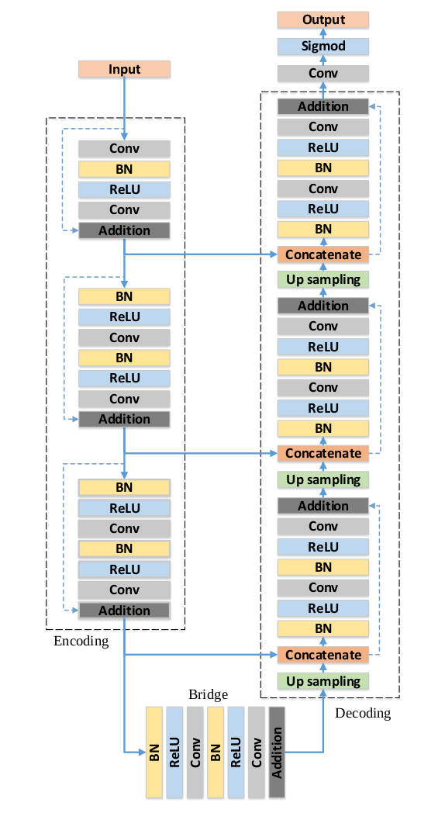
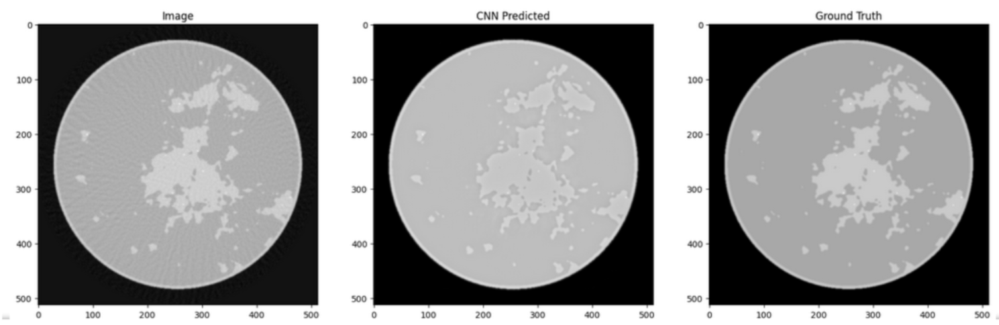
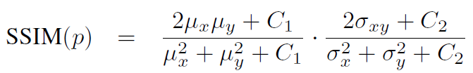
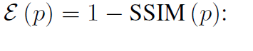

# CT-Inverse-Problem
Computed Tomography is a diagnostic imaging technology that uses x-rays to measure the projection of an object from all directions, and from that data reconstructs the linear attenuation coefficient throughout the object. Filtered back projection (FBP) has been the standard CT image reconstruction method for 4 decades. A simple, fast, and reliable technique, FBP has delivered high-quality images in several clinical applications. However, with faster and more advanced CT scanners, FBP has become increasingly obsolete. Higher image noise and more artifacts are especially noticeable in lower-dose CT imaging using FBP. This performance gap was partly addressed by model-based iterative reconstruction (MBIR). However its long reconstruction time has limited widespread application. Hybrid iterative reconstruction partially addressed these limitations by blending FBP with MBIR and is currently the state-of-the-art reconstruction technique. The clinical introduction of deep learning reconstruction  algorithms over the past 5 years has demonstrated the potential of deep learning to rapidly reconstruct images with low noise, desired noise texture, and preserved spatial resolution while providing the opportunity to reduce radiation dose.   

**This is a research project under the guidance of Dr C.S. Sastry at Indian Institute of Technology, Hyderabad. We investigate the potential and performance of deep learning algorithms to reconstruct CT Images and observe if they can outperform the current traditional state of the art techniques.**

The Data that I used consists of 4000 Image pairs, where each pair has True Breast Phantom image and its 128-view FBP reconstructed counterpart. ResUNet is the first Architecture that we used. The code for this project can be found [here](https://github.com/dhanushpittala11/CT-Inverse-Problem/blob/2abccd50bd16fcd0141b68d43a950ca9a1117b43/CT_TORCH_R.ipynb).

## **1. RESUNET:**

### 1.1 Architecture
#### 1.1.1 Basic Buidling Block

 Residual units consists of:
 * Two 3x3 convolutional block.
 * A Skip Connection from the input to the output of the residual block.

 Convolutional block consists of:
 * One Batch Normalization layer.
 * One ReLU Activation layer.
 * One Convolutional layer.
   
 
 Figure(b) is the residual block.

#### 1.1.2 Entire Architecture

The figure above shows the  architecture of the RESUNET. It consists of Encoding, Bridge and Decoding Parts. 

To the above architecture I added one residual block each in encoder and decoder parts and implemented it in this project. 

#### 1.1.3  Reconstructed Images

**Above are the reconstructed images using ResUnet architecture. The Images look too similar to groundtruth images except for few constrast differences which can be corrected by constrast enhancement techniques. The Goal here is to know how much the deep learning models are able to learn from the data and are able to reconstruct the images.**

**Next architecture that I used was FBPCONVNET**

## 2.FBPConvNet

### 2.1 Architecture

The architecture of FBPConvNet is similar to that of ResUnet except for the additional skip connection between the input layer to the output layer in FBPConvNet.

You can notice the additional skip connection right from the input to the output in the above figure.
### 2.2 Reconstructed Images

The Reconstructed image is similar to the groundtruth image except for the contrast which can be improved by some contrast enhancement techniques.

## Loss Function

I used SSIM loss. SSIM stands for Structural Similarity Index and is a perceptual metric to measure similarity of two images. Commonly used loss functions such as L2 (Euclidean Distance) correlate poorly with image quality because they assume pixel-wise independance. For instance blurred images cause large perceptual but small L2 loss.

SSIM takes into account luminance, contrast and structure and is computed as follows:

The loss is computes as:

where p represents a pixel of an image.

## References

* (https://arxiv.org/pdf/2005.10755.pdf)
* (https://arxiv.org/pdf/1611.03679.pdf)
* (https://arxiv.org/pdf/1711.10684.pdf)
* (https://ece.uwaterloo.ca/~z70wang/publications/SPM09.pdf)
